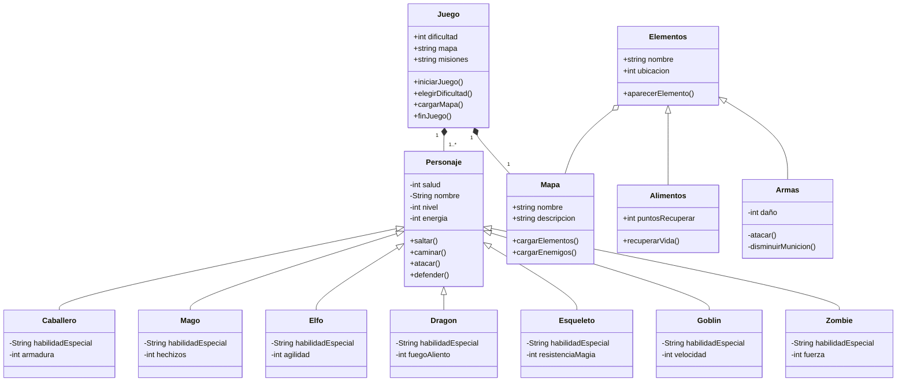

# Fantasy Quest

## Descripción

## UML Diagram

```mermaid
classDiagram
    Personaje <|-- Caballero
    Personaje <|-- Mago
    Personaje <|-- Elfo
    Personaje <|-- Dragon
    Personaje <|-- Esqueleto
    Personaje <|-- Goblin
    Personaje <|-- Zombie
    Personaje : -int salud
    Personaje : -String nombre
    Personaje: -int nivel
    Personaje: -int energia
    Personaje : +saltar()
    Personaje : +caminar()
    Personaje : +atacar()
    Personaje : +defender()
    Juego "1" *-- "1..*" Personaje
    Juego : +int dificultad
    Juego : +string mapa
    Juego : +string misiones
    Juego : +iniciarJuego()
    Juego : +elegirDificultad()
    Juego : +cargarMapa()
    Juego : +finJuego()
    Juego "1" *-- "1" Mapa
    Mapa : +string nombre
    Mapa : +string descripcion
    Mapa : +cargarElementos()
    Mapa : +cargarEnemigos()
    Elementos o-- Mapa
    Elementos : +string nombre
    Elementos : +int ubicacion 
    Elementos : +aparecerElemento()
    Elementos <|-- Alimentos
    Elementos <|-- Armas
    class Alimentos {
    +int puntosRecuperar
    +recuperarVida()   
    }
    class Armas{
    -int daño
    -atacar()
    -disminuirMunicion()
    }
    class Caballero{
      -String habilidadEspecial
      -int armadura
    }
    class Mago{
      -String habilidadEspecial
      -int hechizos
    }
    class Elfo{
      -String habilidadEspecial
      -int agilidad
    }
    class Dragon{
      -String habilidadEspecial
      -int fuegoAliento
    }
    class Esqueleto{
      -String habilidadEspecial
      -int resistenciaMagia
    }
    class Goblin{
      -String habilidadEspecial
      -int velocidad
    }
    class Zombie{
      -String habilidadEspecial
      -int fuerza
    }

```