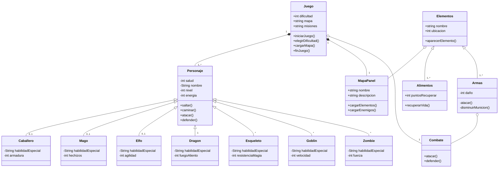

# Fantasy Quest

## Descripción

Fantasy Quest es un juego de rol en el que el jugador asume el papel de un héroe que debe embarcarse en una búsqueda épica para salvar el reino de las garras de un malvado dragón. El juego incluirá personajes con habilidades únicas, varios tipos de enemigos, múltiples niveles de dificultad y elementos interactivos en los escenarios.

Los jugadores pueden elegir entre varios personajes, cada uno con habilidades únicas. Por ejemplo, un guerrero puede tener fuertes ataques cuerpo a cuerpo, mientras que un mago puede lanzar hechizos poderosos. Además, habrá diferentes tipos de enemigos en cada escenario, desde goblins y esqueletos hasta dragones y zombies. Cada enemigo tendrá sus propias estadísticas y ataques.

Hemos añadido 3 biomas; El bosque encantado, La mazmorra y La montaña nevada. Cada uno de estos escenarios tendrá enemigos y objetos característicos.

El juego tendrá una pantalla principal, un mapa donde el personaje principal buscará el camino para encontrar y derrotar al dragón, sin embargo por el camino se encontrará enemigos con los que tendrá que pelear para poder seguir avanzando. Estos combates aparecen al tocar al enemigo, abriéndose una pantalla secundaria.

### Interfaces

MapaPanel :
https://i.ytimg.com/vi/7Pg_vPJEajk/maxresdefault.jpg

Combate:
https://cdn.andro4all.com/andro4all/2020/09/oie241727462OkHn8UM.jpg

## UML Diagram

